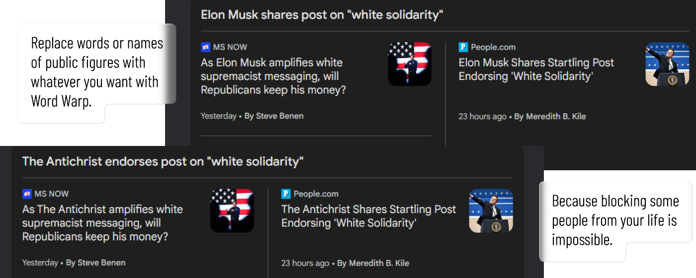

# Word Warp

Word Warp is a browser extension that replaces configured words on web pages. It ships with sensible defaults and a Settings page so anyone can customize their own replacements.

  

  

## Demo

  

## Features

- Replace multiple words or phrases with custom text
- Settings UI with saved preferences
- Works in Edge, Chrome, and Firefox

## Build / Load

### Edge
1. Open `edge://extensions`
2. Enable Developer mode
3. Click "Load unpacked" and select `edge/`

### Edge (manual install)
1. Open `edge://extensions`
2. Enable Developer mode
3. Drag and drop `edge.crx` onto the extensions page
4. Click "Add extension" when prompted

Note: This `.crx` is unsigned and for manual install only. We hope to make this extension available in the Edge Add-ons store soon.

### Chrome
1. Open `chrome://extensions`
2. Enable Developer mode
3. Click "Load unpacked" and select `chrome/`

### Firefox
1. Open `about:debugging#/runtime/this-firefox`
2. Click "Load Temporary Add-on" and select `firefox/manifest.json`

## Packaging (Edge)

Upload `edge/word-warp-edge.zip` to the Microsoft Add-ons portal.
